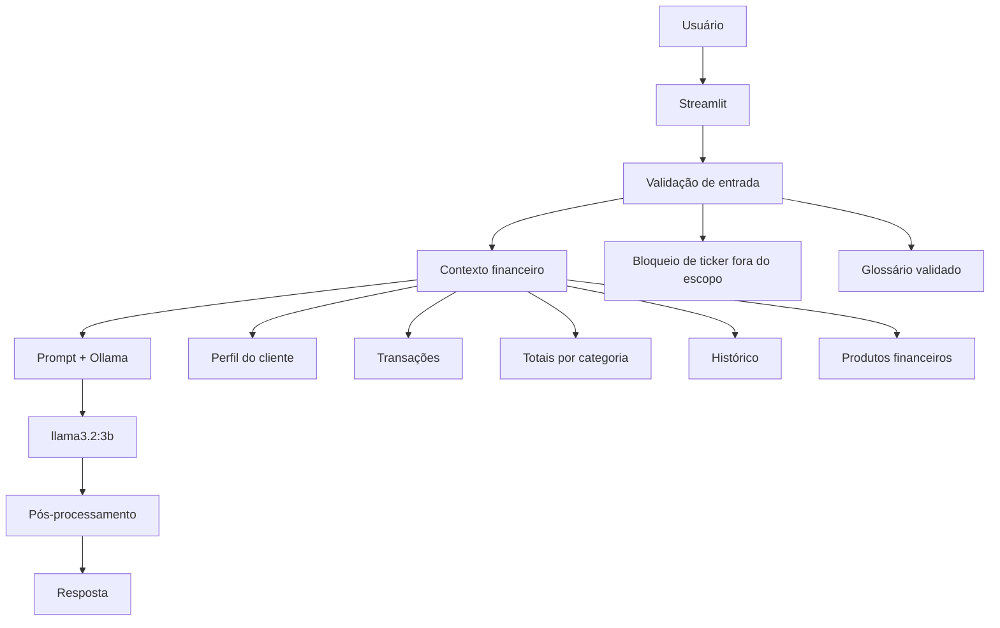

# Documentação do Agente Finan

## Caso de Uso

### Problema

Muitas pessoas têm dificuldade para entender conceitos básicos de finanças pessoais, como reserva de emergência, tipos de investimentos e organização dos gastos.

### Solução

O **Finan** é um agente de educação financeira que explica conceitos de forma simples e didática. Ele utiliza dados estruturados do cliente para criar exemplos práticos, mas não transforma essas informações em recomendações de investimento.

### Público-Alvo

Pessoas iniciantes em finanças pessoais que querem aprender a organizar suas finanças e compreender conceitos financeiros.

---

## Persona e Tom de Voz

### Nome do Agente

**Finan — Educador Financeiro**

### Personalidade

- Educativo e paciente;
- Usa exemplos práticos;
- Explica termos técnicos em linguagem simples;
- Não julga nem critica a situação financeira do cliente;
- Responde de forma curta e direta quando a pergunta for objetiva.

### Tom de Comunicação

Informal, acessível e didático, como um professor particular explicando o assunto para alguém que está começando.

### Exemplos de Linguagem

- **Saudação:** “Oi! Sou o Finan, seu educador financeiro. Como posso te ajudar a aprender hoje?”
- **Explicação:** “Deixa eu te explicar isso de um jeito simples, usando um exemplo.”
- **Limitação:** “Não posso recomendar onde investir, mas posso explicar como esse tipo de investimento funciona.”

---

## Arquitetura

### Diagrama

### Componentes

| Componente | Descrição |
|------------|-----------|
| Interface | Streamlit |
| Linguagem | Python |
| LLM | `llama3.2:3b` executado localmente pelo Ollama |
| Processamento de dados | Pandas |
| Base de Conhecimento | Arquivos JSON e CSV na pasta `data` |
| Validação | Regras implementadas em Python + prompt do sistema |

### Fluxo de funcionamento

1. O usuário envia uma pergunta pela interface do Streamlit.
2. A aplicação verifica se a pergunta contém um ticker fora dos produtos disponíveis.
3. Os dados do perfil, transações, histórico e produtos são carregados como contexto.
4. Quando a pergunta contém termos financeiros conhecidos, o glossário validado é incluído no prompt.
5. Os totais de despesas por categoria são calculados previamente com Pandas.
6. O prompt é enviado ao Ollama, que executa o modelo `llama3.2:3b`.
7. Perguntas objetivas recebem um limite menor de geração e passam por pós-processamento para reduzir desvios de assunto.
8. A resposta é exibida no Streamlit.

---

## Base de Conhecimento

A aplicação utiliza quatro fontes principais na pasta `data`:

- `perfil_investidor.json` — perfil, renda, patrimônio, reserva e metas;
- `transacoes.csv` — receitas e despesas utilizadas nos exemplos;
- `historico_atendimento.csv` — histórico de atendimentos anteriores;
- `produtos_financeiros.json` — produtos financeiros disponíveis para explicações educativas.

Além dos arquivos, o código possui um glossário com definições validadas para termos como Selic, CDI, Tesouro Selic, CDB, LCI, LCA, FII, renda fixa, renda variável e reserva de emergência.

---

## Segurança e Anti-Alucinação

### Estratégias Adotadas

- [x] Não recomenda investimentos, ativos ou produtos específicos.
- [x] Utiliza os dados do cliente apenas como exemplos educativos.
- [x] Calcula previamente os totais das despesas com Pandas.
- [x] Utiliza definições validadas para conceitos financeiros presentes no glossário.
- [x] Intercepta tickers fora do escopo antes da chamada ao modelo.
- [x] Restringe perguntas fora de educação financeira pessoal.
- [x] Não solicita, fornece ou repete senhas, dados bancários ou números de cartão.
- [x] Utiliza `temperature: 0.1` e `seed: 42` para favorecer respostas mais consistentes nos testes.
- [x] Limita a geração de respostas conforme o tipo de pergunta.

### Limitações Declaradas

O Finan:

- não recomenda investimentos específicos;
- não fornece aconselhamento financeiro personalizado;
- não trabalha com cotações ou rendimentos de ações individuais fora do escopo da base;
- não solicita ou manipula senhas, números de cartão ou outros dados bancários confidenciais;
- não substitui um profissional financeiro certificado;
- pode apresentar limitações próprias de modelos de linguagem menores, como pequenas imprecisões conceituais ou desvios de contexto.

---

## Avaliação e Aprendizados

Durante o desenvolvimento, diferentes modelos foram testados. A avaliação mostrou que modelos menores podem apresentar dificuldades em cálculos, conceitos financeiros e manutenção do contexto.

Por esse motivo, o projeto passou a combinar **prompt + dados estruturados + cálculos determinísticos + glossário validado + regras de validação em Python**.

Nos testes realizados, o `llama3.2:3b` apresentou comportamento consistente em relação à restrição de não recomendar investimentos específicos, enquanto o bloqueio determinístico de tickers evitou respostas sobre ativos específicos fora do escopo.

O principal aprendizado foi que comportamentos importantes não devem depender apenas do prompt: quando uma regra pode ser implementada de forma determinística no código, isso aumenta o controle e a previsibilidade do agente.
